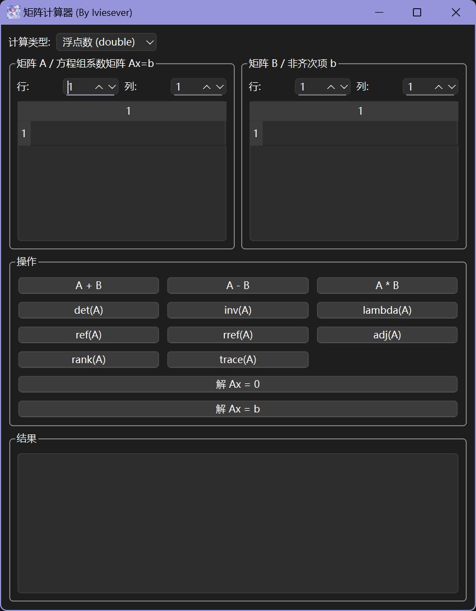

[**简体中文**](./readme-cn.md)
# Matrix Calculator

**By lviesever**

This is a graphical matrix calculator developed using modern C++23 and Qt 6. It offers a rich set of matrix operations, from basic addition, subtraction, and multiplication to advanced functions like inverse, eigenvalues, and solving systems of linear equations. It is designed to facilitate the study and research of linear algebra.

## Features

This project implements a variety of core matrix operations:

#### Data Types
- Supports 2 calculation types: **floating-point numbers (double)** and **rational numbers**, which can be switched in the top-left corner of the interface.

#### Basic Matrix Operations
- **Matrix Addition** (A + B)
- **Matrix Subtraction** (A - B)
- **Matrix Multiplication** (A * B)

#### Advanced Matrix Operations
- **Determinant** (det(A))
- **Inverse** (inv(A))
- **Eigenvalues** (lambda(A))
- **Adjugate Matrix** (adj(A))
- **Rank** (rank(A))
- **Trace** (trace(A))
- **Row Echelon Form** (ref(A))
- **Reduced Row Echelon Form** (rref(A))

#### Linear Equation System Solver
- Solve **homogeneous systems of linear equations** `Ax = 0`
- Solve **non-homogeneous systems of linear equations** `Ax = b`

## Tech Stack

- **Core Language**: C++23
- **GUI Framework**: Qt 6
- **Development Environment**: Visual Studio 2026 Insiders

## How to Build

### Prerequisites
1.  **C++23 Compiler**: This project is developed with Visual Studio 2026 Insiders. The latest version of **Visual Studio 2026 Insiders** is recommended.
2.  **Qt Development Environment**: This project depends on a **statically compiled** Qt 6 library. This means you need to either build Qt from source with the `-static` configuration option yourself, or obtain a pre-built static version for your environment.
3.  **Qt VS Tools**: In Visual Studio's "Extensions" menu, search for and install the `Qt Visual Studio Tools` extension. Ensure it is correctly configured with the path to your Qt installation.

> **Note**: The `.gitignore` file in this repository is the default one generated by Visual Studio and may not include intermediate files generated by the Qt build system (e.g., `moc_`, `ui_`).

## License

The source code of this calculator is licensed under the **MIT License**.

---

#### **Compliance Reminder for Statically Linking Qt**

This project uses the open-source version of the Qt framework (LGPLv3) and links to it **statically**. According to the LGPLv3 license requirements, when distributing an application in this manner, you must provide the end-user with a way to re-link the application with a modified version of the Qt library. This can be achieved, for example, by providing your application's object files (.obj).

#### **Legal Disclaimer**

- All code and features in this project are provided for **learning, reference, and technical communication purposes only**. This project is provided "as is", without warranty of any kind, express or implied.
- All the information mentioned above regarding the Qt license is a friendly reminder based on the author's personal understanding and **does not constitute legal advice**.
- The author is not a legal expert and cannot provide an authoritative interpretation of LGPLv3 compliance. **Please be sure to read, understand, and comply with the official Qt open-source license agreement.**
- The author assumes no responsibility for any license compliance issues arising from your use, modification, or distribution of this software (and its derivatives). The author shall not be liable for any direct or indirect damages, data loss, or legal disputes caused by the use or inability to use this software.
